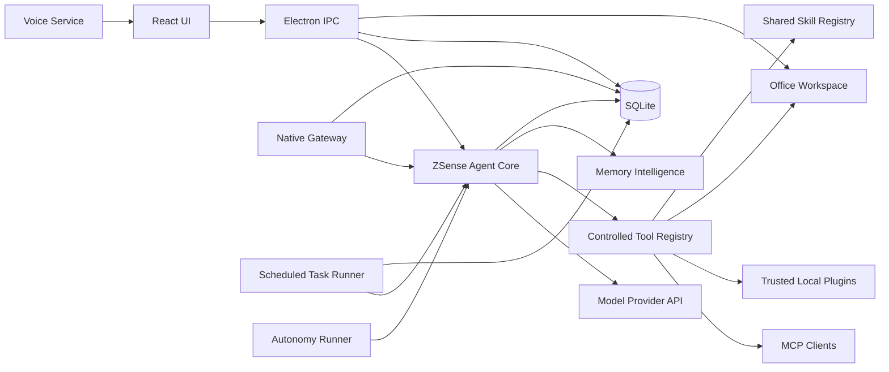

# ZSense 架构

## 目标

ZSense 自己提供 Agent 的完整运行链路。模型请求、工具循环、会话、工作区、长期记忆、技能、定时任务、外部消息和语音不经过外部 Agent 进程。

## 运行链路



### ZSense Agent Core

`electron/services/zsense-agent-core.mjs` 负责：

- 统一 OpenAI 兼容、Anthropic 和 Gemini 的流式协议；
- 推理、正文、Token 和工具事件分流；
- 按进展推进的受控工具循环：不设固定轮次硬上限；重复且无进展时收尾；
- 工作区文件、终端与后台进程、网页提取、隔离浏览器、Office、钉钉工具和技能加载；
- 上下文长度计算与自动压缩；
- 回复语言约束、敏感信息脱敏和中止请求；
- 自动记忆提取与周期性记忆复盘。

Bot 对话、AI 对话、网关消息和定时任务都调用同一 Core，因此不会出现不同入口拥有不同能力的问题。

### 工具、上下文与回滚

`electron/services/agent-capability-service.mjs` 提供完整的工作区文件工具、终端与进程管理、安全网页提取、浏览器自动化、Checkpoint / Rollback、Session Search、Toolset、MCP、Todo、Goal、Loop 和 Heartbeat。文件路径会解析符号链接真实路径：工作区内的普通读写自动放行，工作区外的读取同样放行，工作区外的写入、删除等破坏性操作逐次审批（`CommandRisk` 会把它归到 `terminal:external-path-write`、`filesystem:external-write` 等类别）；Agent 不再有“受限/完全访问”开关，只保留这套审批边界。

工作区根目录支持 `.zsense.md`、`AGENTS.md`、`CLAUDE.md` 和 `.cursorrules`，对话支持 `@file:`、`@dir:`、`@url:` 和 `@git-diff`。这些内容会标记信任边界并扫描常见提示注入语句，不得覆盖系统安全规则、凭证保护或审批流程。

修改文件、移动、删除和修改型终端命令会在 `<userData>/agent-core/capabilities/checkpoints` 创建最多 40 个回滚点。

### MCP 与技能

`electron/services/mcp-service.mjs` 支持 stdio 和 Streamable HTTP MCP，执行 initialize / initialized 握手并维护 `Mcp-Session-Id`。HTTP OAuth / Bearer Token 保存在操作系统安全存储；没有声明 `readOnlyHint` 的 MCP 工具必须在前台确认。

技能统一由 `<userData>/agent-core/skills` 下的 `SKILL.md` 管理，可单独编辑、分配给 Bot 并检查更新。旧安装留下的 `plugins/` 目录不会自动删除，但应用不再加载其中的可执行插件代码；已同步到 `skills/` 的技能仍按普通本地技能显示。

### 会话和隔离

每个会话持久化 `runtime_session_id`、模型、推理强度、工作区和 Token 用量。路由边界为：

```text
(connection_id, external_thread_id) -> bot_id -> conversation_id
```

同一种渠道可以配置多个机器人账号；每个连接记录自己的 `bot_id`、凭证作用域、授权用户和外部线程，不会依据“最后配置的 Bot”动态选择。

### 消息网关

`electron/services/zsense-gateway-service.mjs` 使用各平台 Node SDK 或官方 HTTP 协议连接 Telegram、Discord、Slack、钉钉、飞书、企业微信、微信 iLink 和 Webhook。服务由 Electron 主进程启动和关闭，每 30 秒巡检并重建失效连接。

授权数据保存在 `<userData>/agent-core/gateway/authorization.json`。未知用户的第一条消息只建立待授权项；批准后再次发来的消息才进入固定 Bot。外部消息以平台消息 ID 去重。

### 记忆

记忆属于 Bot 命名空间；AI 对话使用保留的 `__zsense_native__` 命名空间。借鉴 Hermes 的精简常用记忆与按需历史检索，但不依赖 Hermes 进程或记忆文件：每轮先按词项相关性选择记忆，为明确偏好与人工策展事实保留少量预算，总注入量最高约 5,000 字符，单条也会截断。未注入的长期记忆可通过当前空间的 `memory_search` 查询，原始会话可通过 `session_search` 查询。

成功回答后在后台运行严格的结构化提取，不阻塞本轮完成：候选记忆必须包含可在用户原文中找到的证据，不允许保存凭证或指令覆盖类内容；相似自动记忆优先合并，人工记忆不会被自动更新。达到指定成功回合数后，后台复盘近期用户消息和现有记忆；复盘失败释放本轮占用，下一轮可以重试。记忆在模型上下文中仅作低信任背景资料，不构成操作授权。

### 技能

技能是工作区级资源，全部位于 `<userData>/agent-core/skills`。数据库中的 `bot_skills` 只记录允许使用该技能的 Bot。Core 只向当前 Bot 暴露已经分配的技能；AI 对话读取至少分配给一个 Bot 的共享技能。

内置技能随应用升级。用户技能支持本地创建、编辑、导入和删除；配置 GitHub `SKILL.md` 地址的技能可以检查并更新，但失败时不会覆盖当前文件。

### 定时任务

每个任务固定模型、技能、工作区和频率。执行器在本地生成内部任务会话，通过 Core 运行，并保存回复模型、耗时、Token、推理和工具调用。内部任务会话只在任务运行历史显示。

对话里的 Agent 通过 `scheduled_task` 工具（autonomy 工具集）管理同一份数据：`list`/`create`/`update`/`toggle`/`run`/`delete`。创建和修改会先校验参数（频率、`HH:mm`、Cron、模型是否可用、技能是否存在），再请求用户确认；模型与工作区默认沿用当前会话，因此 Agent 不需要用户重复填写。确认通过后由 `ScheduledTaskRunner` 写库并推送新的工作区快照，所以“定时任务”面板会立即刷新。后台入口（定时任务、自治任务、远程设备任务）拿不到审批界面，调用会被直接拒绝，避免绕过用户确认。

### 自主任务

`electron/services/autonomy-runner.mjs` 每 15 秒检查持久化 Goal、Loop 和 Heartbeat。Goal 可连续推进并在达到成功条件后由工具标记完成；Loop 按间隔运行；Heartbeat 在没有实质变化时返回 `NO_CHANGE`，不写入会话也不通知。状态保存在 `<userData>/agent-core/capabilities/state.json`，应用启动后恢复。后台运行不能弹出并代替用户回答审批或澄清，因此遇到危险操作会停止该工具并留下错误；用户开启“自动审批”后，后台任务会先请模型判断，判断通过才继续，否则仍然停止并留下错误。

### 语音

唤醒词保存在 ZSense 设置中，可通过录入向导识别、校正并实际测试。STT 使用随应用部署的 whisper.cpp base 多语言模型；TTS 使用 MOSS-TTS-Nano ONNX 模型和本地音色。识别与播报均不读取模型 API Key，也不把音频上传到网络。

### 每次任务的执行成本

让任务更快结束，靠的是三层：轮次、并行和热路径开销。**度量方法、基线数字、已落地与已否决的优化清单见 [efficiency.md](./efficiency.md)**；重新测量用 `npm run bench:efficiency`。

- **轮次**：一轮模型往返就是一次完整请求（工具模式 16KB + 系统提示词 + 历史）。提示词要求把互不依赖的工具调用合并进同一轮、脚本自己完成“读取→修改→校验”再打印一段摘要；第 12/24/36 轮及此后每 40 轮给出非终止性的收敛提醒。正常取得新结果的任务不设固定轮次硬上限；连续相同错误或三轮完全相同的工具结果会触发无进展收尾。工具调用先写运行游标再执行，异常恢复时将未完成工具标记为结果未知，防止盲目重放写入。收尾轮若模型返回空内容，ZSense 会自动再要一次结论。
- **并行**：见下一节。
- **热路径**：数据库的会话消息、会话列表和活动流查询全部走表达式索引（索引表达式必须与查询里的 `datetime(...)` 完全一致，否则用不上）；只读一个设置字段时使用 `database.loadSettings()`，不再为取一个值把全部会话、消息与 `reasoning`/`tool_events` JSON 读进内存（实测同一份数据上 0.1ms 对 28.8ms）；webhook 入站和 Bot ID 校验同理走 `loadGatewayConnections()` / `loadBotIds()`。
- **渲染进程**：流式回答按约 60ms 合并一次再更新消息状态（工具见 `src/utils/stream-delta-buffer.ts`），会话进度更新在没有任何可见变化时返回原数组引用让 React 跳过重渲染；否则一次长回答会触发上千次整树渲染，长任务下界面明显变卡。
- **运行游标**：`agent-cursors.json` 每次保存都会重写整个文件，因此运行结束后只保留末尾 8 步用于排查，避免文件随运行次数无限增长。

### 并行执行

一轮模型回复里的多个工具调用会先构建成依赖图（`buildToolDependencyGraph`）再执行（`executeToolDependencyGraph`，最多 4 个并发）：标记为只读的工具之间没有依赖，会真正并行；写入、终端、审批类工具会形成依赖屏障，与之前的所有调用串行，读取结果仍按模型给出的原始顺序回灌。因此“并行”不会破坏同一文件上的写入顺序。

跨步骤的并行由子 Agent 承担：`SubagentService` 默认最多 3 个子 Agent 同时运行（`maxTreeConcurrent = min(12, maxConcurrent × 2)`），每个父级最多 4 个、任务树最深 4 层；同一轮里发出多个 `delegate_task` 就会并行开跑。系统提示词要求“先规划再分发、互不依赖才并行、有依赖或写同一个文件的必须串行、分支返回后只做一次合并校验”，避免并行本身变成额外开销。

### 对话里的两种交互卡

- **审批卡**：只有可能产生重要影响的操作才会出现。默认开启的自动审批会先让当前模型判断一次：认为你会同意就直接执行并记录到「最近自动审批」；判断为拒绝、超时或失败时仍然弹窗，并在弹窗里写明原因（未开启/这次没给出判断/需要人工确认）。模型只负责放行，永远不会替你拒绝；删除、安装发布、读取凭证等永久禁止的分类不参与自动放行。如果用户在最近的原话里明确点名了这个动作（例如“把余额发到我钉钉”），审批员会按用户自己要求处理，不再当作可疑的对外发送。
- **选择卡（澄清问题）**：已填内容和“已提交”状态保存在组件之外、按澄清请求 ID 索引，所以切换会话再回来不会变回空白卡片；未答完时按钮会显示“还差 N 项”；如果对应的运行已经结束或被取消（主进程在取消/结束时会发 `clarify-expired`），卡片直接显示“这次选择已经失效”并提示重新发送，而不是让人反复点击没有反应。

### 审批与自动审批

所有审批都经过 `AgentCapabilityService.requestApproval()`：先查本轮缓存与“始终允许”授权，然后（如果用户开启了自动审批）调用 `ZsensAgentCore.decideAutoApproval()`，用当前对话的模型判断这次操作该不该放行。判断结果只会“自动放行”：模型给出 `allow: true` 时跳过人工确认并写入审计（`capabilities/state.json` 的 `autoApprovals`，最多保留 100 条，可在界面查看）；模型判断为拒绝、超时、返回非法格式或调用失败时，一律回退到原来的弹窗审批。始终禁止的操作（提权、磁盘与关机、危险递归删除等）在到达审批前就已被拒绝，自动审批无法绕过。

### 设备互联

### 局域网 Web 访问

除桌面窗口外，界面也可以通过浏览器使用（`http://<局域网地址>:39073`）。实现要点：

- **静态资源**复用构建产物 `dist/`，服务端在 `index.html` 里注入 `bridge-client.js`；
- **调用与桌面端完全同源**：`electron/services/web-bridge-service.mjs` 在沙箱里加载真实的 `preload.cjs`，网页传 `{ path, args }` 时用真实函数构造出 IPC 通道与参数，再交给注册时登记下来的同一批处理器（`ipc.mjs` 的 `safeHandle` 包装，所以返回值同样是 `{ ok, data }` 信封）；
- **事件**由处理器里的 `event.sender.send(...)` 转发到 SSE 长连接，浏览器端再按“订阅路径 → 通道”分发给页面回调；
- **安全**：只接受局域网来源（公网来源 403）、必须用 6 位访问口令换取 HttpOnly 会话 Cookie（登录失败限速、换口令即失效）、账号与安全类通道列入黑名单；单次调用 120 秒兜底超时，避免某个通道卡住时把网页请求挂死。
- **HTTPS**：默认启用。首次开启用 `openssl req -x509` 生成本机自签证书（`web-bridge/tls/cert.pem`，SAN 含全部局域网地址；地址变化时按签名重签），https 会话 Cookie 带 `Secure`；另开 `端口+1` 的 http 服务只做 308 跳转。浏览器对自签证书会告警一次，接受后页面进入安全上下文，`navigator.clipboard` 等能力才可用（`isSecureContext`）。

### 设备互联的读取权限

**配对成功即可读**：已配对设备之间可以直接读取对方的内容，不需要在对方机器上再开开关。读取走 `POST /v1/data`（与 `/v1/inspect` 一样用配对时交换的共享密钥认证，且只接受局域网来源），`scope` 决定读哪一块：

| scope | 内容 |
| --- | --- |
| `overview` | 运行状态、版本、运行时长与各项统计 |
| `bots` | 全部 Bot 的名称、角色、模型、记忆数、渠道、分配到的技能与指令 |
| `conversations` / `conversation` | 会话列表；按 `conversationId` 读取某个会话的**完整对话内容** |
| `skills` / `memories` / `scheduledTasks` / `settings` | 技能、长期记忆、定时任务与运行记录、设置（**凭据类字段自动隐藏**） |
| `directory` / `file` | 列目录、读文件内容（单次上限 2MB，超出截断；二进制文件只返回元信息） |

唯一不外发的是凭据类信息：字段名匹配 `api key / token / secret / password / credential / private key / authorization / cookie` 的值一律替换为 `[已隐藏：凭据不外发]`，密钥库本身也不在可读范围内。

**写入仍需授权**：在那台机器上真实执行任务（`run_task_on_device`）需要对方开启“允许在本机执行任务”，且每次都要发起方用户确认。

对话里的 Agent 也能看到并使用这些能力：“设置 → 设备互联”的快照（本机地址与端口、已配对设备、发现到但未配对的设备）会随会话上下文注入系统提示词，另有四个属于 `devices` 工具集的工具：`list_devices`、`read_device_data`（上面那张表就是它的 scope）、`run_task_on_device`、`pair_device`（按 IP 直连，需要用户确认）。

发现与配对有三条通道：

1. **UDP 组播自动发现**（`239.255.90.71:39071`，每 4 秒公告一次）——网络允许组播时最快。
2. **主动扫描 `scan()`**：先发组播/广播探测（`type: 'probe'`，对端收到后立即单播回公告），再对每个局域网 /24 逐台 `GET /v1/status`（默认端口 `39072` 以及已知对端端口，并发 48，单点超时 900ms，3 秒冷却）。**路由器隔离组播、AP 隔离、跨网段时，只要两台设备能互通，扫描就能找到对方。**

   扫描的**触发条件只有三个**（不做后台轮询，避免无谓流量）：
   - **用户开启设备互联时**立刻扫一次（`setEnabled(true)` → `start({ scan: true })`）；
   - **每次打开“设置 → 设备互联”界面时**自动扫一次（界面挂载时调 `refresh()`）；
   - 用户点右上角图标按钮，或 Agent 调用 `list_devices { scan: true }`。
   
   应用启动时如果设备互联本来就是启用状态，**不会**触发扫描。
3. **按 IP 直连**（`pairByAddress`，单播 HTTP `POST /v1/pair`）——连扫描都不通时（例如对方在别的网段、只开了特定端口）的最后手段。第二条是为组播被隔离的网络准备的（访客网络、AP 隔离、跨网段）：局域网内能互相 ping 通即可配对，之后的心跳与远程调用同样走单播。设备互联的 HTTP 端口默认固定 `39072`（写入状态文件，占用时回退随机端口），这样对方才能按固定端口直连，也便于配置防火墙。

`electron/services/device-link-service.mjs` 使用局域网组播发现（239.255.90.71:39071）加上每台设备自己的 HTTP 服务，只接受私网来源。首次连接需要在对方屏幕读取 6 位短时配对码，配对后双方各自保存随机共享密钥到系统安全存储，之后的心跳、撤销与远程调用都带该密钥。

受信任设备之间可以做两件事，都需要在接收方“设置 → 设备互联”里对该设备单独开启：

- `POST /v1/inspect`（允许对方读取本机状态）：返回对方设备的版本、运行时长、Bot / 会话 / 记忆 / 定时任务 / 技能数量以及 Agent Core 是否可用。
- `POST /v1/run`（允许对方在本机执行任务）：`electron/services/device-task-runner.mjs` 在本机 AI 对话空间创建 `channel_id='device-link'` 的会话，使用本机默认模型、默认工作区和共享技能调用同一个 `ZSenseAgentCore.chatStream()`。

远程任务带有明确的审批边界：传给 Core 的 `approvalHandler` 直接拒绝一切需要审批或澄清的操作并计数（`refusedOperations`），因此终端写操作、删除、工作区外访问等都不会因为请求来自已配对设备就被放行。同一台设备同时只允许一条远程任务，请求方默认 5 分钟超时、最长 10 分钟。

### 软件更新

`electron/services/update-service.mjs` 默认读取公开的 `zhima071/ZSense` GitHub Releases API，也允许用户覆盖更新地址。解析 Release 的版本与附件后，按平台选择 `.dmg` / `.exe`；自定义地址仍支持 `latest-mac.yml` / `latest.yml` 或 JSON 清单。检查更新只提示并调用系统浏览器打开下载地址，不会自动下载或安装。Release 只上传 macOS DMG、Windows EXE、Android APK 三种安装包。

## 数据迁移

数据库 schema 31 新增供应商无关的 `external_thread_id` 和 `external_message_id`。升级时旧外部会话标识只复制一次，旧运行引擎标记改为 `legacy`。物理旧字段继续存在，确保用户可以回滚和读取历史数据；所有新会话只写新字段并由 ZSense Core 继续。

启动时还会把旧版私有技能目录复制到新的 Agent Core 技能目录，复制操作不启动、不导入也不调用任何旧进程。
